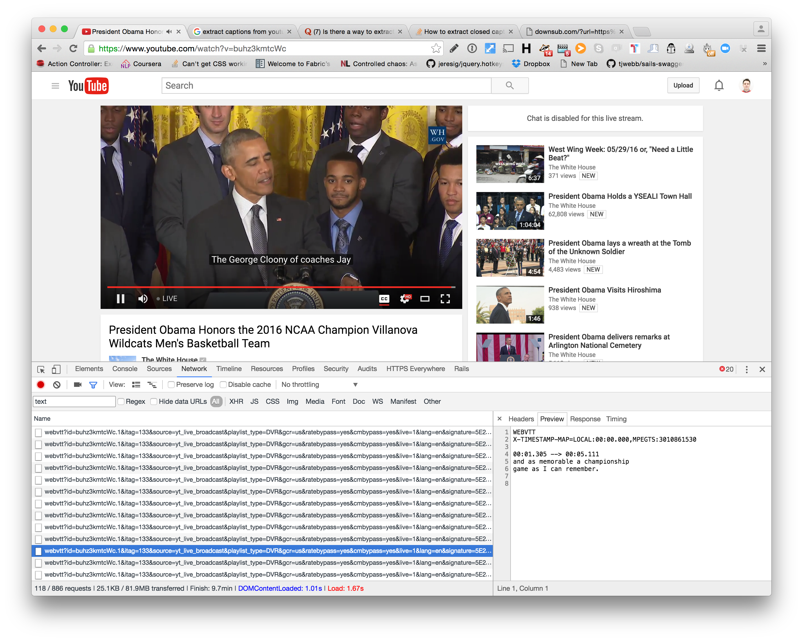
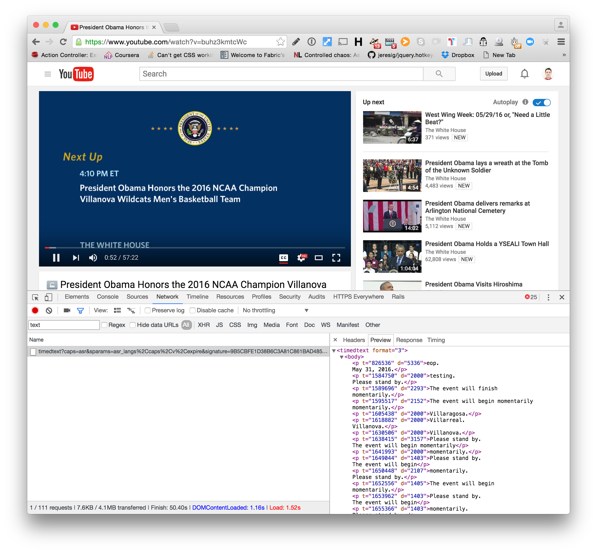
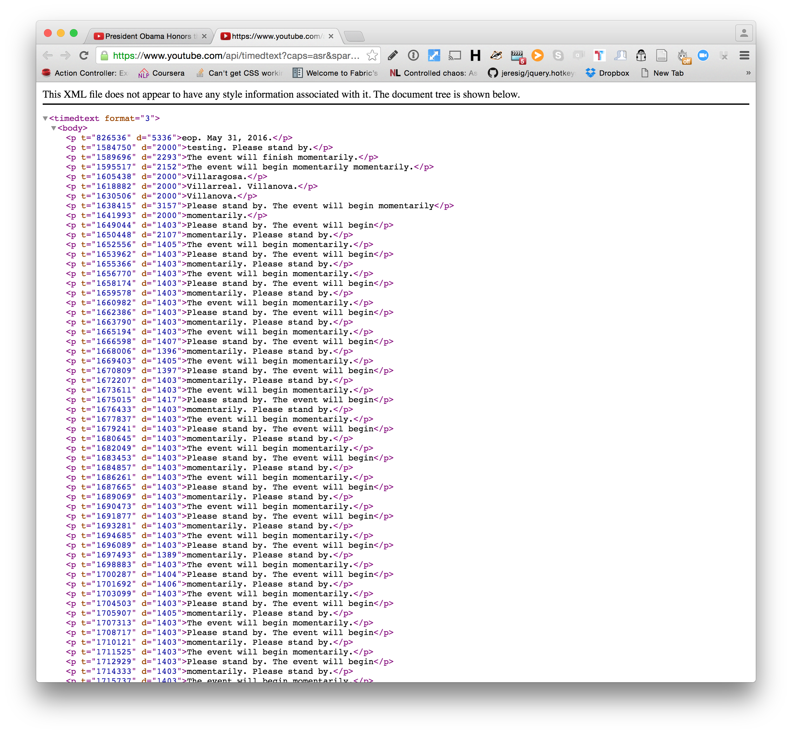

# Scraping srt files from Youtube live

## During broadcast

During a YouTube Live a journalist might want to trace back a significant mention to be able to extract a clip from the video.

As it turns out, YouTube Live already supports captions.



These can be seen with the Chrome developer toolbar looking at the network tab.


This is the URL of the first caption
```
https://manifest.googlevideo.com/api/manifest/webvtt?id=buhz3kmtcWc.1&itag=133&source=yt_live_broadcast&playlist_type=DVR&gcr=us&ratebypass=yes&cmbypass=yes&live=1&lang=en&signature=5E2BA172309B5C3673DFBA94DCA5F594F7739D88.6D677BCB236BD059EFB22E1FE7AA5D8489355273&sver=3&upn=LzxAVVWeAKc&key=dg_yt0&fexp=3300001,3300104,3300132,3300161,3312381,3312531,3312722,3313262,9412859,9412913,9416126,9416891,9416984,9422596,9428398,9428769,9431012,9433096,9433634,9433653,9433946,9434012,9434529,9435247,9435527,9435733,9435783,9435876,9436011,9436835,9437066,9437676,9437777&cpn=RjJH6Ok1cILwgc-5&mpd_version=4&pacing=0&ip=199.180.217.169&ipbits=0&expire=1464747397&sparams=ip,ipbits,expire,id,itag,source,playlist_type,gcr,ratebypass,cmbypass,live,lang&alr=yes&keepalive=yes&mime=text%2Fvtt&c=WEB&cver=1.20160525&sq=420
```

and this is the url of the last caption

```
https://manifest.googlevideo.com/api/manifest/webvtt?id=buhz3kmtcWc.1&itag=133&source=yt_live_broadcast&playlist_type=DVR&gcr=us&ratebypass=yes&cmbypass=yes&live=1&lang=en&signature=5E2BA172309B5C3673DFBA94DCA5F594F7739D88.6D677BCB236BD059EFB22E1FE7AA5D8489355273&sver=3&upn=LzxAVVWeAKc&key=dg_yt0&fexp=3300001,3300104,3300132,3300161,3312381,3312531,3312722,3313262,9412859,9412913,9416126,9416891,9416984,9422596,9428398,9428769,9431012,9433096,9433634,9433653,9433946,9434012,9434529,9435247,9435527,9435733,9435783,9435876,9436011,9436835,9437066,9437676,9437777&cpn=RjJH6Ok1cILwgc-5&mpd_version=4&pacing=0&ip=199.180.217.169&ipbits=0&expire=1464747397&sparams=ip,ipbits,expire,id,itag,source,playlist_type,gcr,ratebypass,cmbypass,live,lang&alr=yes&keepalive=yes&mime=text%2Fvtt&c=WEB&cver=1.20160525&sq=630
```

Where these URL are exactly the same except for the last 3 digits. first one has `420` and last one is `630`. These have some correspondence to the time of the broadcast.

Now that we now a range we can scrape the srt files. Save them locally and recombine them into one final srt.

## After broadcast

### Youtube XML
After the broadcast an XML of the transcription is available. see `after_broadcast.rb` script.

```
https://www.youtube.com/api/timedtext?caps=asr&sparams=asr_langs%2Ccaps%2Cv%2Cexpire&signature=9B5CBFE1D38B6C3A81C861BAD485AB6CEFDB6A93.463F9650F62C199A7174B6C893D387B4B840DE9A&v=buhz3kmtcWc&asr_langs=ru%2Ces%2Cde%2Cit%2Cko%2Cfr%2Cja%2Cnl%2Cen%2Cpt&hl=en_US&key=yttt1&expire=1464753909&lang=en&name=cc1&fmt=srv3
```







<!-- or can use http://downsub.com/ and put url of youtube video to get an srt
 -->

## TODO
- [ ] add gem file with mechanize gem.
- [ ] Parse youtube XML to srt
